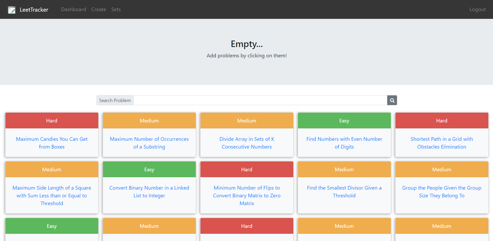

# LeetTracker

## Table of Contents

1. [Overview](#overview)
2. [Demo](#demo)
3. [Getting Started](#getting-started)
   - [Setting Up AWS Backend](#setting-up-aws-backend)
   - [Installing](#installing)
4. [Built With](#built-with)

## Overview:

Creating your set of LeetCode problems on an excel sheet is time consuming and hard to share with others. LeetTracker is a web application that allows users to easily create their own set or view/clone existing sets that other users have created. Users can track their progress on sets of problems and also share their LeetCode experience with others—via a sharable url.

The objective of LeetTracker is to easily share set of problems (targeted towards a company), track the user's progress, and easily add/delete/update a set of LeetCode problems.

Live Website: https://master.d3i5xbbmcj6qbb.amplifyapp.com/

## Demo:





## Getting Started

To setup a localhost web server for developmental purposes.

Git clone this repository and follow the steps below.

### Setting Up AWS Backend

The backend resources were generating with AWS Amplify. To set up the backend, multiple AWS files are required that must be configured by the user themselves.

A more detailed guide to set up the backend can be found in the Amplify documentation: [here](https://aws-amplify.github.io/docs/cli-toolchain/quickstart?sdk=js)

**Below are the main commands used to set up the backend—if unsure, reference the documentation above.**

```javascript
npm install -g @aws-amplify/cli
```

**Configure the Amplify Command Line Interface (CLI) with your account information.**

```javascript
amplify configure
```

**The init command must be executed at the root directory of the project. This initilizes the project for the Amplify CLI to work with.**

```javascript
amplify init
```

**Adds the backend to the project by setting up DynamoDB to perform CRUD operations.**

```javascript
amplify add api
```

**Adds authentication to the project by setting up Cognito.**

```javascript
amplify add auth
```

### Installing

Open up the cloned repo and install the required packages in terminal.

```javascript
npm install
```

To run the application.

```javascript
npm start
```

## Built With

- [React.js](https://reactjs.org/): A JavaScript library for building user interfaces. ReactJS is used for handling the view layer and allows us to create reusable UI components.
- [AWS Amplify](https://aws.amazon.com/amplify/): A development platform for building secure, scalable mobile and web applications.
  - [DynamoDB](https://aws.amazon.com/dynamodb/): A NoSQL database service that supports key-value and document data structures
  - [Cognito](https://aws.amazon.com/cognito/): Allows user sign-up, sign-in, and access control to your web and mobile apps quickly and easily.
- [GraphQL](https://graphql.org/) : An open-source data query and manipulation language for APIs, and a runtime for fulfilling queries with existing data.
- [JQuery](https://jquery.com/): A JavaScript library designed to simplify HTML DOM tree traversal and manipulation, as well as event handling, CSS animation, and Ajax.
- [React Bootstrap](https://react-bootstrap.github.io/): An open-source CSS framework directed at responsive, mobile-first front-end web development.
